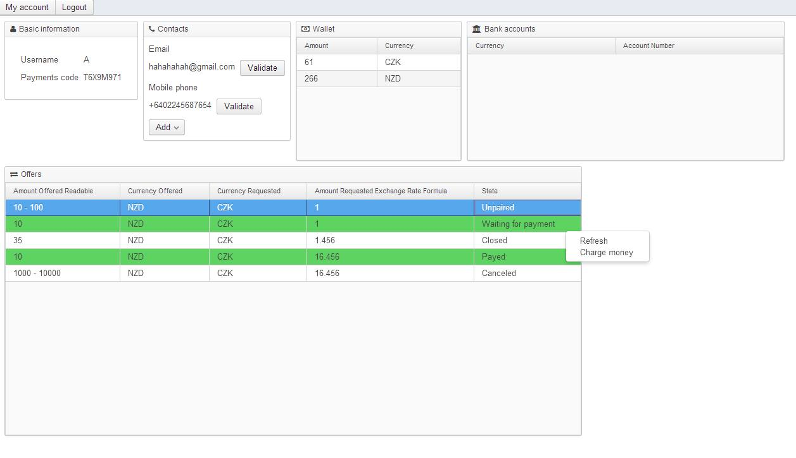
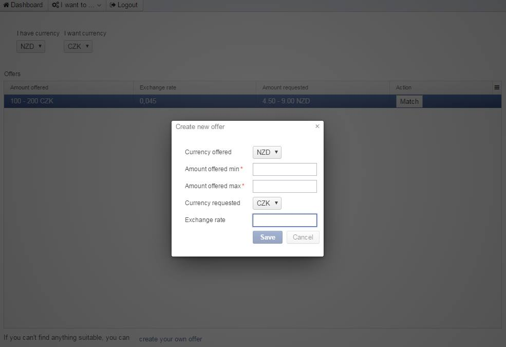
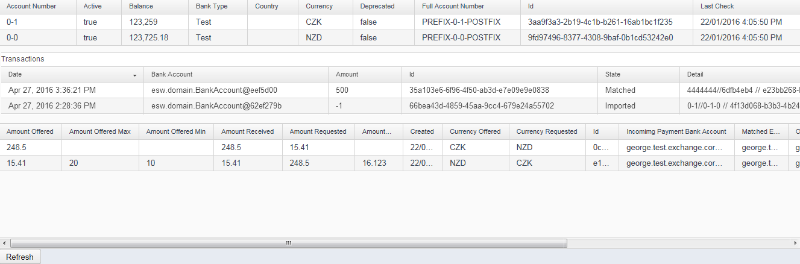

#P2p Currency exchange platform

Attempt to develop p2p currency exchange platform & learn a little bit about ES & CQRS.

[Vaadin](https://vaadin.com/) is used for the UI, [Axonframework](http://www.axonframework.org/) as an ES & CQRS, [SimpleBank](https://github.com/promne/simple.bank) as an bank for testing.

## Screenshots

User dashboard

New exchange offer

Backoffice data

